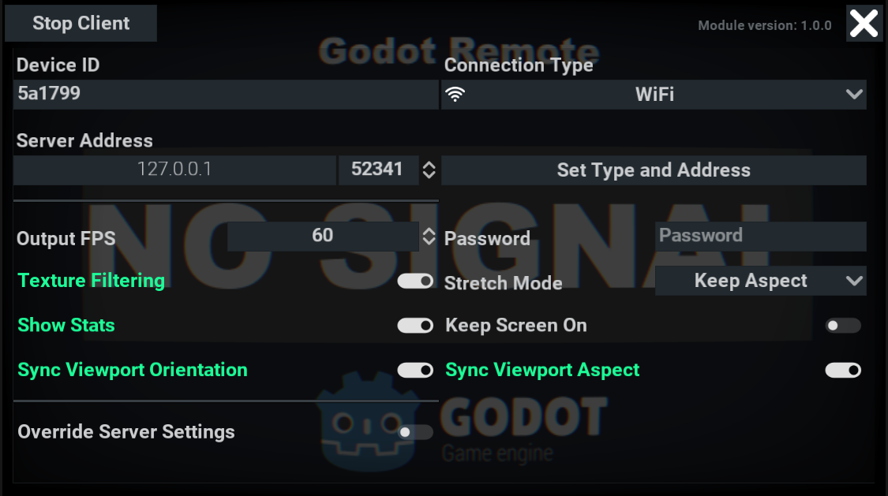

# Godot Remote

This is cross platform native module for [Godot Engine](https://github.com/godotengine/godot) v3 for control apps and games over WiFi or ADB.

If you are developing on a non-touch device, this module is the best way to quickly test touch input or test mobile sensors data.

[Video Demonstration](https://youtu.be/LbFcQnS3z3E)

## Donations

[Paypal](https://paypal.me/dmitriysalnikov)

## Compiling the Module

### As a module

1. [configure environment](https://docs.godotengine.org/en/3.2/development/compiling/index.html) to build editor for your platform (you need to clone [3.2 branch](https://github.com/godotengine/godot/tree/3.2) not master)
2. copy ```godot_remote``` folder to the ```modules/``` directory or make [symlink](https://en.wikipedia.org/wiki/Symbolic_link)
3. compile engine with instructions from documentation above (e.g. ```scons p=windows tools=yes -j[place here count of your CPU threads]```)
4. run ```bin/godot[based on config]```.

If everything compiles successfully, you'll find the new category in project settings ```Debug/Godot Remote``` where you can configure server.


### As a GDNative library

1. [Configure environment](https://docs.godotengine.org/en/3.2/development/compiling/index.html) to build editor for your platform
2. Generate api.json for GDNative api. ```bin/godot --gdnative-generate-json-api api.json```
3. Copy api.json to the root directory of this repository
4. Compile godot-cpp (e.g. in godot-cpp directory run ```scons generate_bindings=true platform=windows target=release bits=64 -j8 ../api.json```)
5. Compile module for your platform (Available platforms: windows, osx, linux, ios, android. Tested platforms: windows, linux, android)
   1. For android: Run in root directory ```[path to your android ndk root dir]/ndk-build NDK_PROJECT_PATH=. APP_BUILD_SCRIPT=Android.mk  APP_PLATFORM=android-21```
   2. For all other platforms: ```scons platform=windows target=release -j8```
6. Use produced library in ```bin/```

GDNative has limitations so here ```GodotRemote``` is not a singleton and you need to create autoload scene with attached NativeScript for ```GodotRemote``` class.

Enum constants in this version change too (see [API Reference] )

**To work correctly, this [pull request](https://github.com/godotengine/godot-cpp/pull/469) must be accepted, otherwise the module will not work at all. And without this [pull request](https://github.com/godotengine/godot/pull/43227) compilation will just fail.
But even with this fix GDNative is completely broken at the moment especially with arrays and dictionaries.
Therefore, when working with GDNative, unexpected errors and memory leaks may occur that do not exist in a normal module.**

### Additional parameters

Also module has additional compilation parameters for scons script

1. ```godot_remote_no_default_resources``` (yes/no) default no - compile with or without default resources
2. ```godot_remote_disable_server``` (yes/no) default no - do not include server code
3. ```godot_remote_disable_client``` (yes/no) default no - do not include client code

## Download

Precompiled binaries can be found on [GitHub Releases](https://github.com/DmitriySalnikov/GodotRemote/releases) page

### Mobile app

On releases page you can found precompiled mobile app but also it can be downloaded from [Google Play](https://play.google.com/store/apps/details?id=com.dmitriysalnikov.godotremote)

## Configure Mobile App

To open settings menu you need to touch the screen with 5 fingers at once.

Then you'll see this settings menu:



**Important:** after entering server address you should apply it by pressing `Set Type and Address` or `Set Type and Port`

## Custom client

If need to support other platforms or you need a specific version of module integrated to the client app, you can build client from source code placed [here](godot_remote_client).

If you don't want to use my client app you can check the [example client project](examples/simple_client) and build your own client.

Or you can donate me some money with request to buy iPhone and adapt a client for it 🙂

## API Reference

Methods will be declared follows this template:

```python
return_type function_name([arg_name1 : type [= defalut value]][, arg_name2 : type [= defalut value]])
```

**Important:** All enums in GDNative version is exposed in GodotRemote class because of limitations.
For example, if you want to use StreamState.STREAM_ACTIVE from GRClient you need to get property GRClient_STREAM_ACTIVE of GodotRemote __object__

```python
# Godot module:
GRClient.STREAM_ACTIVE:

# GDNative
# *GodotRemote is autoload scene with attached NativeScript
GodotRemote.GRClient_STREAM_ACTIVE
```

### GodotRemote

Main class of module.

```python
# --- Properties

# Canvas layer that shows notifications
# type int, default 128
notifications_layer

# Notifications position on screen
# type NotificationsPosition, default TC
notifications_position

# Is notifications enabled
# type bool, default true
notifications_enabled

# Base duration for showing notifications
# type float, default 3.0
notifications_duration

# Notifcations style
# type GRNotificationStyle
notifications_style

# --- Methods

# Notifications

# Adds or fully update existing notification
# @title: Notification title
# @text: Text of notification
# @notification_icon: Notification icon from enum NotificationIcon
# @update_existing: Updates existing notification
# @duration_multiplier: Multiply base notifications duration
void add_notification(title: String, text: String, notification_icon: NotificationIcon = 0, update_existing: bool = true, duration_multiplier: float = 1.0)

# Adds new notification or append text to existing notification
# @title: Notification title
# @text: Text of notification
# @icon: Notification icon from enum NotificationIcon
# @add_to_new_line: Adds text to new line or adds to current line
void add_notification_or_append_string(title: String, text: String, icon: NotificationIcon, add_to_new_line: bool = true, duration_multiplier: float = 1.0)

# Adds notification or update one line of notification text
# @title: Notification title
# @id: Line ID
# @text: Text of notification
# @icon: Notification icon from enum NotificationIcon
# @duration_multiplier: Multiply base notifications duration
void add_notification_or_update_line(title: String, id: String, text: String, icon: NotificationIcon, duration_multiplier: float = 1.0)

# Clear all notifications
void clear_notifications()

# Get notifications list
# @return list of all visible notifications
Array get_all_notifications()

# Get notification with specified title or null
# @title: Notification title
# @return matched notification
GRNotificationPanel get_notification(title: String)

# Get all notifications with specified title
# @title: Notification title
# @return list of visible notifications
Array get_notifications_with_title(title: String)

# Remove notifications with specified title
# @title: Notifications title
# @is_all_entries: Delete all notifications with @title if true
void remove_notification(title: String, is_all_entries: bool = true)

# Remove exact notification by reference
# @notification: Notification reference
void remove_notification_exact(notification: Node)

# Client/Server

# Create device: client or server
# @device_type: Type of device
# @return true if device created successful
bool create_remote_device(device_type: DeviceType = 0)

# Start device
# @return true if device valid
bool start_remote_device()

# Create and start device
# @device_type: Type of device
void create_and_start_device(device_type: DeviceType = 0)

# Remove and delete currently working device
# @return true if succeed
bool remove_remote_device()

# Get device
# @return client, server or null
GRDevice get_device()

# Utility functions

# Not exposed to GDScript fuctions from Input class
# And currently not available in GDNative
void set_accelerometer(value: Vector3)
void set_gravity(value: Vector3)
void set_gyroscope(value: Vector3)
void set_magnetometer(value: Vector3)

# Set GodotRemote log level
# @level: Level of logging
void set_log_level(level: LogLevel)

# Get GodotRemote module version
# @return module version in format "MAJOR.MINOR.BUILD"
String get_version()

# --- Signals

# Device added
device_added()

# Device removed
device_removed()

# --- Enumerations

DeviceType:
    DEVICE_AUTO = 0
    DEVICE_SERVER = 1
    DEVICE_CLIENT = 2

ImageCompressionType:
    IMAGE_COMPRESSION_UNCOMPRESSED = 0
    IMAGE_COMPRESSION_JPG = 1
    IMAGE_COMPRESSION_PNG = 2

LogLevel:
    LL_NONE = 4
    LL_DEBUG = 0
    LL_NORMAL = 1
    LL_WARNING = 2
    LL_ERROR = 3

NotificationIcon:
    NOTIFICATION_ICON_NONE = 0
    NOTIFICATION_ICON_ERROR = 1
    NOTIFICATION_ICON_WARNING = 2
    NOTIFICATION_ICON_SUCCESS = 3
    NOTIFICATION_ICON_FAIL = 4

NotificationsPosition:
    NOTIFICATIONS_POSITION_TL = 0
    NOTIFICATIONS_POSITION_TC = 1
    NOTIFICATIONS_POSITION_TR = 2
    NOTIFICATIONS_POSITION_BL = 3
    NOTIFICATIONS_POSITION_BC = 4
    NOTIFICATIONS_POSITION_BR = 5

TypesOfServerSettings:
    USE_INTERNAL_SERVER_SETTINGS = 0
    SERVER_PARAM_VIDEO_STREAM_ENABLED = 1
    SERVER_PARAM_COMPRESSION_TYPE = 2
    SERVER_PARAM_JPG_QUALITY = 3
    SERVER_PARAM_SKIP_FRAMES = 4
    SERVER_PARAM_RENDER_SCALE = 5
```

### GRNotificationStyle

Helper class to store parameters of notifications style

```python
# --- Properties

# Style of background notifications panel
# type StyleBox
panel_style

# Theme for notification close button
# type Theme
close_button_theme

# Close button icon texture
# type Texture
close_button_icon

# Notification title font
# type Font
title_font

# Notification text font
# type Font
text_font

# --- Methods

# Get notification icon from this style
# @notification_icon: Notfication icon id
# @return icon texture of null
Texture get_notification_icon(notification_icon: NotificationIcon)

# Set notification icon in this style
# @notification_icon: Notfication icon id
# @icon_texture: Icon texture
void set_notification_icon(notification_icon: NotificationIcon, icon_texture: Texture)

```

### GRDevice

Base class for client and server

```python
# --- Properties

# Connection port
# type int, default 52341
port

# --- Methods

# Get average FPS
# @return average FPS
float get_avg_fps()

# Get average ping
# @return average ping
float get_avg_ping()

# Get device status
WorkingStatus get_status()

# Start device
void start()

# Stop device
void stop()

# --- Signals

# Device status changed
status_changed(status: WorkingStatus)

# --- Enumerations

WorkingStatus:
    STATUS_STARTING = 3
    STATUS_STOPPING = 2
    STATUS_WORKING = 1
    STATUS_STOPPED = 0
```

### GRServer

```python
# --- Properties

# Server password
# type String, default ""
password

# Path to the custom input scene.
# type String, default ""
custom_input_scene

# Is custom input scene compressed
## Doesn't work in GDNative
# type bool, default true
custom_input_scene_compressed

# Compression type of custom input scene
## Doesn't work in GDNative
# type File.CompressionMode, default FastLZ
custom_input_scene_compression_type

# --- Methods

# Set whether the stream is enabled
bool set_video_stream_enabled(value : bool)

# Get whether the stream is enabled
bool is_video_stream_enabled()

# Set how many frames to skip
bool set_skip_frames(frames : int)

# Get the number of skipping frames
int get_skip_frames()

# Set JPG quality
bool set_jpg_quality(quality : int)

# Get JPG quality
int get_jpg_quality()

# Set the scale of the stream
bool set_render_scale(scale : float)

# Get stream scale
float get_render_scale()

# Force update custom input scene on client
void force_update_custom_input_scene()

# Get resize viewport node
# @return resize viewport or null
GRSViewport get_gr_viewport()


# --- Signals

# On client connected
client_connected(device_id: String)

# On client disconnected
client_disconnected(device_id: String)

# On orientation of client's screen or viewport changed
client_viewport_orientation_changed(is_vertical: bool)

# On client's screen or viewport aspect ratio changed
client_viewport_aspect_ratio_changed(stream_aspect: float)

```

### GRClient

```python
# --- Properties

# Capture input only when containing control has focus
# type bool, default false
capture_on_focus

# Capture input only when stream image hovered
# type bool, default true
capture_when_hover

# Capture mouse pointer and touch events
# type bool, default true
capture_pointer

# Capture input
# type bool, default true
capture_input

# Type of connection
# type ConnectionType, default CONNECTION_WiFi
connection_type

# Frequency of sending data to the server
# type int, default 60
target_send_fps

# Stretch mode of stream image
# type StretchMode, default STRETCH_KEEP_ASPECT
stretch_mode

# Use texture filtering of stream image
# type bool, default true
texture_filtering

# Password
# type String, default ""
password

# ID of device
# type String, default 6 random digits and characters
device_id

# Sync viewport orientation with server
# type bool, default true
viewport_orientation_syncing

# Sync viewport aspect ratio with server
# type bool, default true
viewport_aspect_ratio_syncing

# Receive updated server settings
# type bool, default false
server_settings_syncing

# --- Methods

# Restore settings on server
void disable_overriding_server_settings()

# Get server address
# @return server address
String get_address()

# Is connected to server
# @return true if connected to server
bool is_connected_to_host()

# Is stream active
# @return true if stream active
bool is_stream_active()

# Send packet. GRPackets not exposed to GDScript at this moment
# @packet: Packet to send
void send_packet(packet: GRPacket)

# Set server address to connect
# @ip: IP of server
# @return true if address is valid
bool set_address(ip: String)

# Set both server address and port
# @ip: IP of server
# @port: Port of server
# @return true if address is valid
bool set_address_port(ip: String, port: int)

# Set the control to show stream in
# @control_node: Control where stream will be shown
# @position_in_node: Position of stream in parent
void set_control_to_show_in(control_node: Control, position_in_node: int = 0)

# Set custom material for no signal screen
# @material: Custom material
void set_custom_no_signal_material(material: Material)

# Set custom horizontal texture for no signal screen
# @texture: Custom texture
void set_custom_no_signal_texture(texture: Texture)

# Set custom vertical texture for no signal screen
# @texture: Custom texture
void set_custom_no_signal_vertical_texture(texture: Texture)

# Override setting on server
# @setting: Which setting need to change
# @value: Value of setting
void set_server_setting(setting: TypesOfServerSettings, value: Variant)

# --- Signals

# On connection state changed
connection_state_changed(is_connected: bool)

# On stream state changed
stream_state_changed(state: StreamState)

# On mouse mode changed on server
mouse_mode_changed(mouse_mode: Input.MouseMode)

# On received server settings from server
server_settings_received(settings: Dictionary)

# --- Enumerations

ConnectionType:
    CONNECTION_ADB = 1
    CONNECTION_WiFi = 0

StreamState:
    STREAM_NO_SIGNAL = 0
    STREAM_ACTIVE = 1
    STREAM_NO_IMAGE = 2

StretchMode:
    STRETCH_KEEP_ASPECT = 0
    STRETCH_FILL = 1
```

There is no need to describe other classes here

## Custom Input Scenes

In custom input scenes you can use everything you want but to send InputEvent's from client to server you must emulate input.

Example:

```python
func _on_pressed():
    # Create event for pressed state
    var iea_p = InputEventAction.new()
    iea_p.pressed = true
    iea_p.action = "jump"
    # Create event for released state
    var iea_r = InputEventAction.new()
    iea_r.pressed = false
    iea_p.action = "jump"
    # Parse event to send it to the server
    Input.parse_input_event(iea_p)
    Input.parse_input_event(iea_r)
```

## License

MIT license
