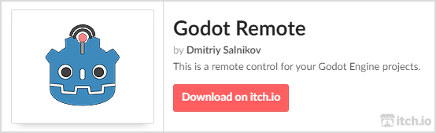

# Godot Remote

This is cross platform native module for [Godot Engine](https://github.com/godotengine/godot) v3 for control apps and games over WiFi or ADB.

If you are developing on a non-touch device, this module is the best way to quickly test touch input or test mobile sensors data (accelerometer, gyroscope, etc.).

API references can be found here: [API.md](API.md)

Building instructions placed here: [BUILDING.md](BUILDING.md)

| Video Demonstration                                                                                      | Custom Packets Demo                                                                                                |
| -------------------------------------------------------------------------------------------------------- | ------------------------------------------------------------------------------------------------------------------ |
| [](https://youtu.be/LbFcQnS3z3E) | [](https://youtu.be/RmhppDWZZk8) |

## Support

[](https://ko-fi.com/I2I53VZ2D)

[](https://paypal.me/dmitriysalnikov)

## Changelogs

Changelogs can be found inside the mobile app or on the [github releases](https://github.com/DmitriySalnikov/GodotRemote/releases) page

## Download

### Editor with Built-in Module

[](https://dmitriysalnikov.itch.io/godot-remote)

### Mobile app

The mobile app can be found on [Google Play](https://play.google.com/store/apps/details?id=com.dmitriysalnikov.godotremote&pcampaignid=pcampaignidMKT-Other-global-all-co-prtnr-py-PartBadge-Mar2515-1), as well as on [itch.io](https://dmitriysalnikov.itch.io/godot-remote).

<a href='https://play.google.com/store/apps/details?id=com.dmitriysalnikov.godotremote&pcampaignid=pcampaignidMKT-Other-global-all-co-prtnr-py-PartBadge-Mar2515-1'></a>

<h6>Google Play and the Google Play logo are trademarks of Google LLC.</h6>

## Module Configuration

### Mobile App Quick Setup

1. Open the app and accept the agreement that you understand that this is not a game. Sorry for that, but random people from Google Play just download this app and think it's a game, then rate it 1 star. 
2. Then you'll see the main screen where you need to click on the `Open Settings` 
3. Now you need to start Godot Editor with `Godot Remote` module and run one or many projects. 
4. If everything went well, all running projects will be added to the `Available Servers` list in the mobile app. 
5. Just click on one of them from this list to connect. 
6. Close the settings and you're ready to go! 

**Important:** The client and server (smartphone and PC with the Godot editor) must be on the same local network, for example, the PC can be connected to the router via a LAN cable, and the smartphone can be connected via Wi-Fi.

**Important:** `Godot Editor with 'Godot Remote' module` means that you should see the module settings category in your projects settings. This is the easiest way to check the integration of "Godot Remote" in the editor.


Also, starting from version 1.0.2, you can find the `Godot Remote` tool menu in the editor.


### Detailed Setup

Here you can find info about every setting in project and in client app.

#### Mobile App Settings

| Name                                     | Default Value     | Description                                                                                       |
| ---------------------------------------- | ----------------- | ------------------------------------------------------------------------------------------------- |
| Device ID                                | Random Hex String | String ID of device. Currently using only in connection notification.                             |
| Connection Type                          | Auto              | Type of the connection: Auto Connection, WiFi Manual Connection, ADB Connection                   |
| Auto: Listener Port                      | 22765             | The port on which the auto connection mode will work                                              |
| WiFi: Server Address                     | 127.0.0.1:22766   | The exact address and port of the server                                                          |
| ADB: Server Port                         | 22766             | The exact port of the server                                                                      |
| Password                                 |                   | Password used to connect to the server                                                            |
| Output Frequency                         | 120               | Frequency of sending data to the server                                                           |
| Stretch Mode                             | Keep Aspect       | Stream image stretching mode: Keep Aspect, Fill                                                   |
| Stream Texture Filtering                 | on                | Specifies the filtered or pixelated image of the stream                                           |
| Show Stats                               | Hidden            | Amount and type of statistical information                                                        |
| Number of touches to open settings       | 5                 | Indicates how many simultaneous touches are required to open settings during an active connection |
| Keep Screen On                           | on                | Specifies whether to keep the screen on without an active connection                              |
| Capture pointer when custom scene active | on                | Specifies whether to capture touches if a custom input scene is active                            |
| Sync Viewport Orientation                | on                | Specifies whether to send data about the orientation of the device                                |
| Sync Viewport Aspect                     | on                | Specifies whether to send data about the device's aspect ratio                                    |
| Number of decoder threads                | 2                 | The number of threads used to decode the stream image                                             |
| Override Server Settings                 | off               | Shows or hides the server settings that will be applied after the connection                      |
| Sync Server Settings                     | off               | Specifies whether the server should send the settings to the client                               |
| Video Stream                             | on                | Specifies whether the video stream is active                                                      |
| Image Quality                            | 50                | Image quality of the stream                                                                       |
| Image Scale                              | 0.5               | Server viewport resolution multiplier                                                             |
| Target FPS                               | 60                | Server FPS lock                                                                                   |
| Number of processing frames              | 100%              | Specifies how many frames should be displayed                                                     |
| Encoder                                  | JPG               | Encoder type                                                                                      |
| Encoder Threads                          | 2                 | Number of threads used by the encoder                                                             |

##### Show Stats

Available options: Hidden, Simple (FPS, Ping), Detailed (FPS, Ping, Delay with avg/min/max values), Traffic (Sended data, Received data, Total sended data, Total received data), All

#### Project Settings (`Debug/Godot Remote`)

| Name                                    | Description                                             |
| --------------------------------------- | ------------------------------------------------------- |
| general/autostart                       | Automatically start server right after project launched |
| general/use_static_port                 | Use static port instead of dynamic                      |
| general/port                            | Server listener port                                    |
| general/auto_connection_port            | Auto connection broadcasting port                       |
| general/log_level                       | Logging level                                           |
| notifications/notifications_enabled     | Enable notifications                                    |
| notifications/notifications_position    | Position of notifications                               |
| notifications/notifications_duration    | Notification display time                               |
| server/image_encoder_threads_count      | Number of image encoding threads                        |
| server/configure_adb_on_play            | Configuring ADB at project startup.                     |
| server/jpg_compress_buffer_size_mbytes  | JPG encoder buffer size                                 |
| server/password                         | Server password                                         |
| server/target_fps                       | Target FPS with active connection                       |
| server/video_stream_enabled             | Enable video stream                                     |
| server/compression_type                 | Encoder type                                            |
| server/skip_frames                      | Specifies how many frames should be displayed           |
| server/scale_of_sending_stream          | Viewport resolution multiplier                          |
| server/stream_quality                   | Image quality of the stream                             |
| .../custom_input_scene                  | Path to the custom input scene                          |
| .../send_custom_input_scene_compressed  | Enable compression of a custom input scene              |
| .../custom_input_scene_compression_type | Compression type of the custom input scene              |

##### `server/configure_adb_on_play`

This option only available with `general/use_static_port` and requires the correct path to the Android SDK specified in the editor settings (`export/android/android_sdk_path` or `export/android/adb` in Godot 3.2)

## Known Issues and Solutions

<!-- TODO -->

## Advanced

### Custom Client

If need to support other platforms or you need a specific version of module integrated to the client app, you can build client from source code placed [here](godot_remote_client).

If you don't want to use my client app you can check the [example client project](examples/simple_client) and build your own client.

Or you can donate me some money with request to buy iPhone and adapt a client for it 🙂

### Custom Input Scenes

In custom input scenes you can use everything you want but to send InputEvent's from client to server you must emulate input. Or use the `send_user_data` method and `user_data_received` signal for send and receive custom packets.
Example:

```python
# -- With InputEvent's

func _on_pressed():
    # Create event for pressed state
    var iea_p = InputEventAction.new()
    iea_p.pressed = true
    iea_p.action = "jump"
    # Create event for released state
    var iea_r = InputEventAction.new()
    iea_r.pressed = false
    iea_p.action = "jump"
    # Parse event to send it to the server
    Input.parse_input_event(iea_p)
    Input.parse_input_event(iea_r)

# -- With custom packets

# on first device
func _ready():
    GodotRemote.get_device().connect("user_data_received", self, "_on_user_data_received")

func _on_user_data_received(id, data):
    print("Received packet: %s, data: %s" % [id, data])

# on second device
func _on_button_pressed():
    GodotRemote.get_device().send_user_data("bg_color", color, false)
```

## License

MIT license
